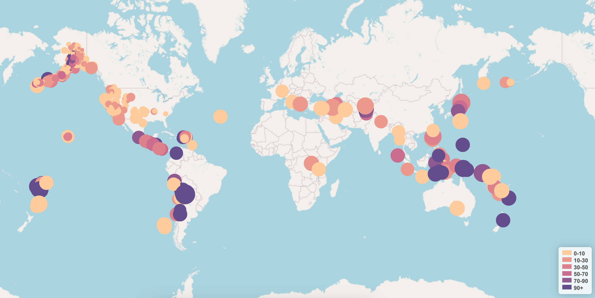

# Leaflet Challenge

---

## Summary

This assignment involves creating a Leaflet map to plot Earthquake data as provided by a GeoJSON URL for [All Earthquake data from the past 7 days.](https://earthquake.usgs.gov/earthquakes/feed/v1.0/summary/all_week.geojson)

---

## Required Dependancies

N/A - All required libraries are referenced in the index.html file to ensure the dash loads correctly. These include;

  - the D3 library  ("https://d3js.org/d3.v5.min.js")
  - the Leaflet library ("https://unpkg.com/leaflet@1.6.0/dist/leaflet.js")

---

## Working Notes

This challenge was a great chance to continue utilising Leaflet and Javascript/HTML/CSS. I was able to pull in the data using D3 and add markers to the mpa with ease.

The legend was the most difficult part to add/get correct - and I explored some CSS stylings to assist in getting the legend to populate correctly. I wanted to make the popup information clean and clear - i'll look to explore further stylings to make the popup feel more modern/exciting.

The map loads and provides the request data without issue.

---

## Bonus

I did not attempt the bonus this week as no additional points were being allocated.

---

## Criteria

The marking criteria reads as follows;
### Map (60 points)
- [x] TileLayer loads without error (20 points)
- [x] Connects to geojson API using D3 without error (20 points)
- [x] Markers with size corresponding to earthquake magnitude (10 points)
- [x] A legend showing the depth and their corresponding colour (10 points)

### Data Points (40 points)
- [x] Data points scale with magnitude level (10 points)
- [x] Data points colours change with depth level (10 points)
- [x] Each point has a tooltip with the Magnitude, the location and depth (10 points)
- [x] All data points load in the correct locations (10 points)

---

## Other Comments

I enjoyed this task after completing Project 3 (which also included a map/leaflet componant. I completed Project 3 before starting this challenge, so having exposed myself to leaflet for a few weeks it made it a lot easier to complete this challenge.

I feel a lot more confident with Javascript now, but still prefer Python...

***Javascript hoo-rah...***

